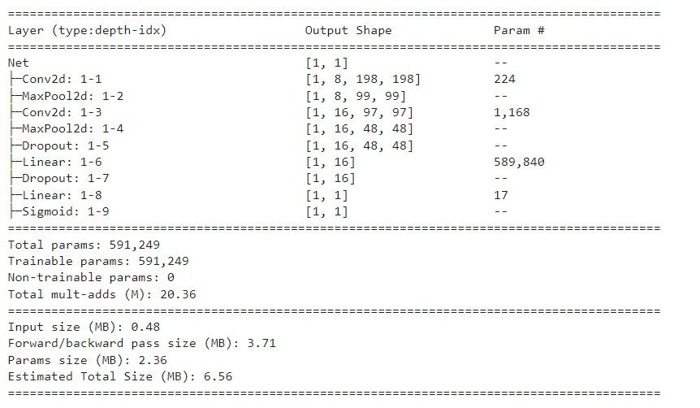

**DeepFake Detection**

Objective: Detect DeepFakes using Convolutional Neural Networks (CNN).

Accuracy Achieved: 97% for the first dataset, 66% for the second dataset.

Link to guide for the Face Extraction using MTCNN: https://github.com/ipazc/mtcnn

Project made by:

-Massimo Di Gennaro

**Images from the First Dataset:**

Real Image:

Fake Image:

**Images from the Second Dataset:**

Real Image:

Fake Image:

**Proposed Architecture:**

